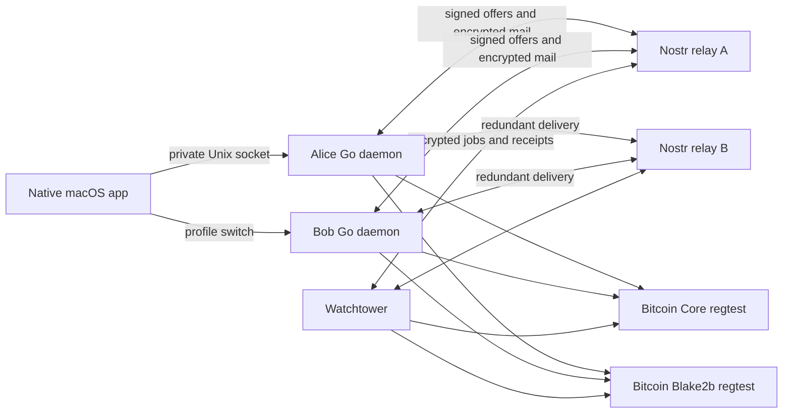

# Architecture

## Components

| Component | Responsibility | Keys and authority |
| --- | --- | --- |
| SwiftUI macOS app | Market, exact-amount offer form, swaps, wallet, recovery controls, local test mining | No standing wallet key storage; recovery phrase is displayed only on explicit request |
| Go trader daemon | Derivation, signing, order projection, negotiation, chain verification, durable state, rescue scheduling | Its own spending keys and Nostr identity; never the counterparty's keys |
| Nostr relays | Store signed public offers and opaque persistent gift wraps; support WebSocket subscriptions | No spending authority and no private swap plaintext |
| Watchtower daemon | Validate and persist fixed rescue templates; acknowledge jobs; scan both chains; insert public preimages and broadcast after delay | Nostr identity and its fee wallet; no trader private keys or undisclosed swap preimages |
| Bitcoin Core node | BTC consensus, mempool, blocks, RPC, watch-only address observations | Faucet keys for regtest only; trader wallets imported as address descriptors with private keys disabled |
| Bitcoin Blake2b node | Actual fork consensus and unified signatures, v2 block headers, mempool and RPC | Same watch-only separation; a distinct chain/datadir |



The two trader daemons are independent. The GUI's profile switch is a convenient local demonstration of two users; it does not merge their wallets. Two local relays demonstrate redundant transport. There is no authoritative matching database: a maker serializes reservations of its own offers, and clients independently verify contracts and chain state.

## Private local API

The GUI exchanges one JSON request/response per Unix-domain socket connection. Socket permissions are `0600`; data directories are created with `0700`. The wallet has no HTTP listener, browser-origin API, or remote signing endpoint. The relay has its own loopback WebSocket listener, with no wallet methods. API implementation and exact methods are described in [Operations](OPERATIONS.md).

The daemon serializes API mutations and swap advancement with a mutex. This keeps offer reservation and wallet input selection atomic within one process. The encrypted bbolt database excludes concurrent writers. Network and RPC calls are bounded by timeouts; a failed durable write permanently stops transaction execution in that process.

## Key derivation and persistence

A 256-bit entropy BIP-39 mnemonic produces one BIP-32 master key. All child derivations are hardened:

```
m / 83696968' / branch' / context[0]' / ... / context[7]'
```

Branch `0` is BTC, `1` is Blake2b, and `2` is the application's Nostr identity. The context is SHA256 of `blakeswap/v1/` plus a purpose string; its eight big-endian words have their high bit cleared before hardened derivation. This leaves 248 bits of context separation. Current purposes are `deposit`, `swap/<random 256-bit swap ID>`, and `nostr-identity`.

Each chain gets distinct deposit and per-swap keys. No extended public keys are disclosed. The current wallet uses a stable deposit/change address per chain, which has privacy costs. It does not claim to be a standard external wallet path or allocate a registered coin type.

Snapshots include the mnemonic, preimages, accepted immutable terms, raw signed transactions, tower jobs, receipts, inbox deduplication records, and the outbox. They are JSON encoded, encrypted with AES-256-GCM using fresh random nonces, and committed atomically by bbolt. A random 32-byte salt and scrypt (`N=32768, r=8, p=1`) derive the key from the vault password. Authenticated associated data binds the state format. Backups copy the consistent encrypted database.

The local launcher creates a random password in a separate `0600` file. This is a regtest convenience, not Keychain-backed production storage. Someone who obtains both files can decrypt the wallet. See [Risks](RISKS.md).

## Chain boundary

Every daemon requires both endpoints to be explicit loopback HTTP addresses. Startup rejects anything except initialized regtest. It checks BTC's 80-byte header and Blake2b's 164-byte v2 header, and requires Blake2b deployment active at height 1. The application domain identifies the rule set, since the regtest chains share a genesis hash.

Go constructs and signs native SegWit funding and spend transactions locally. Nodes receive signed transactions and watch-only address descriptors. BTC signatures use BIP-143 `SIGHASH_ALL`; Blake2b signatures use `SIGHASH_ALL|UNIFIED` (`0x21`). The fork signer is tested against upstream vectors and the actual fork node.

Confirmed funding is checked by outpoint, amount, exact script, and minimum confirmations. The scanner tracks relevant spends in blocks and the mempool, detects tip replacement, reconstructs observations after reorgs, and derives current confirmation counts. Preimage knowledge is saved separately and never rolls back when a revealing transaction disappears.

## Nostr boundary

Public offers use experimental addressable kind `38481` with `d=<offer ID>` and `t=blakeswap-regtest-v1`. This is not a registered general-purpose event kind or NIP-69 fiat order. Private application rumors use kind `10481`, encrypted inside a NIP-59 seal (`13`) and persistent gift wrap (`1059`) using NIP-44 v2. Outer keys are freshly generated and timestamps are randomized up to two days into the past.

Every layer checks event ID, signature, kind, recipient, and author binding. The recipient refuses a rumor whose author differs from the seal's signer. Relays see recipients and traffic timing, and may retain ciphertext indefinitely; this is not perfect anonymity or forward secrecy.

Event IDs use a small bounds-checked NIP-01 canonical serializer with known-event and independent Unicode/escaping fixtures. The pinned Nostr library's optimized serializer fails Go's pointer-check instrumentation, so the application does not call that serializer or its event-signing wrapper. It continues using the library's NIP-44 encryption and btcec's Schnorr primitives; runtime race/pointer checks stay enabled.

The local configuration explicitly names one to three relays used by all parties. Dynamic NIP-17/NIP-65/NIP-10050 relay discovery and Tor routing are not implemented. The daemon replays persistent history on synchronization, deduplicates by authenticated sender and application message ID, and acknowledges processing separately from relay storage. Public ordering follows NIP-01 timestamp and ID tie rules, not a global sequence supplied by any relay.
